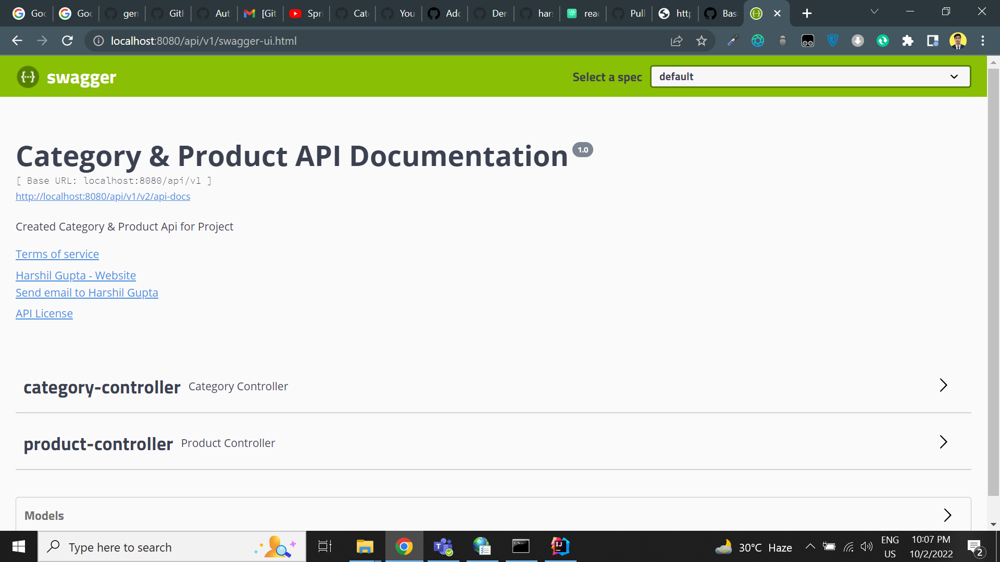
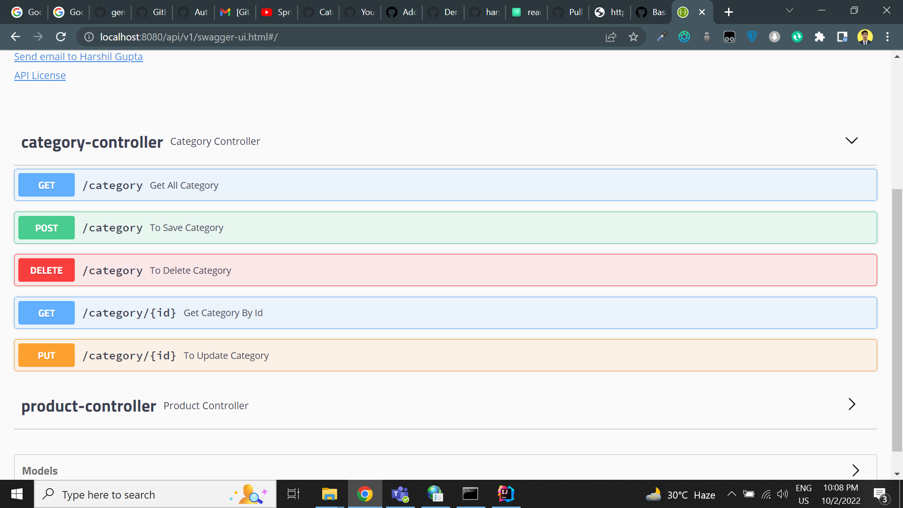
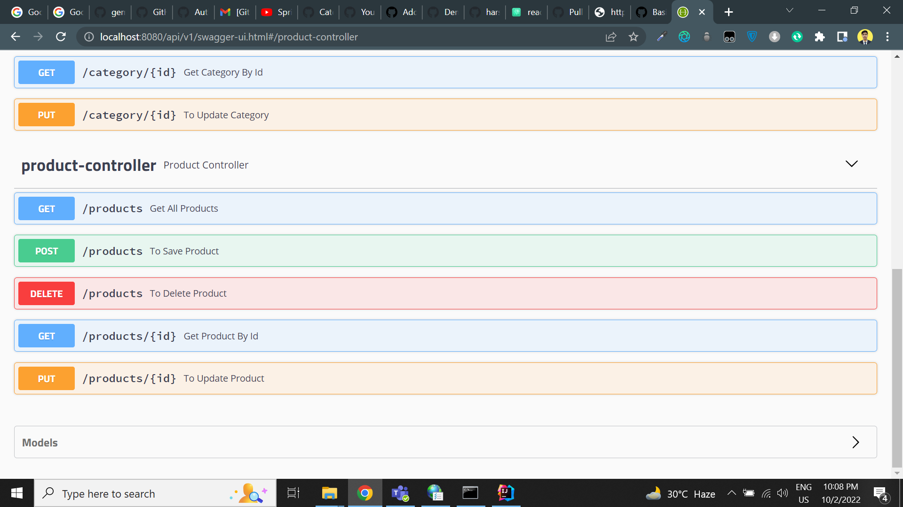
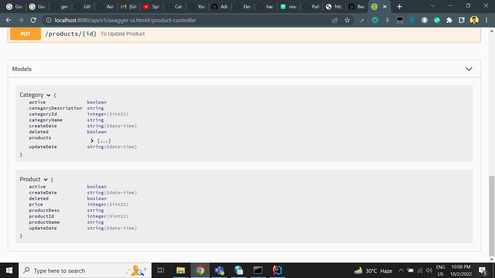

## Ecom

This project based on **Springboot** implementation and it includes **CRUD operation, REST API creation, connects
springboot to mySQL database, Testing, Table mapping, swagger documentation, exception handling and etc**.

## Features

- GET API to get all category details.
- GET API to get category detail by categoryId.
- POST API to save new category.
- PUT API to update category.
- DELETE API to soft delete category.
- GET Api to get all product details.
- GET API to get product detail by productId.
- POST API to save product details.
- PUT API to update department details.
- DELETE API to soft delete department.

## API Documentation (Open API)

